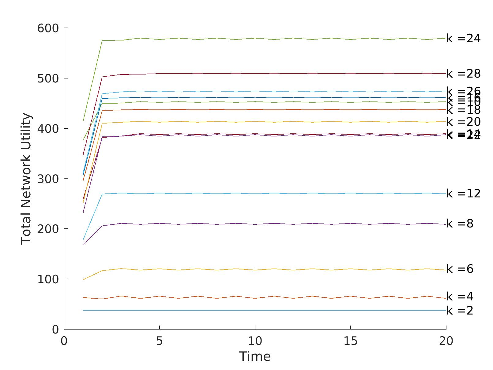
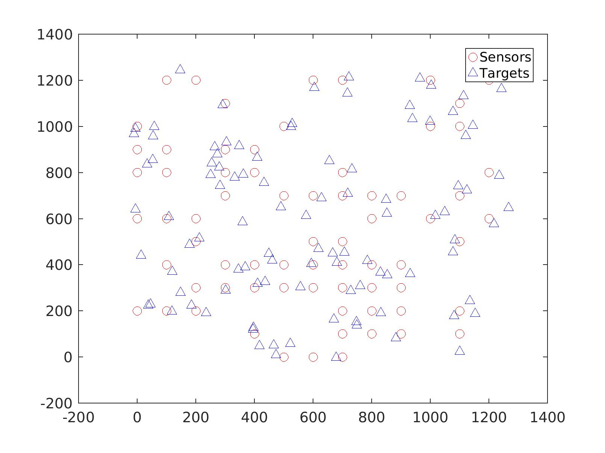

#  Reinforcement learning and game theory based energy optimization in energy harvesting sensor networks.

Since energy harvesting sensor networks(such as sensor networks that relay on solar energy) often have unreliable energy source, it is important to have an adaptable energy optimization algorithm for them. 

This project proposes an optimization algorithm for moving target sensor networks. The project uses Game theory for spatial optimization(taking into account k-neighbourhood)  and Reinforcement learning for temporal optimization.

The following figure shows the algorithm converging fast to the optimal setting.
 

The following graph shows the subset of sensors that are in "on" state after the algorithm converges the rest of the sensors are in "off" state.

